## Table of Contents

<div style="line-height: 1.5;">
  <a href="#getting-started"><strong>1 Introduction</strong></a><br/>
  &nbsp;&nbsp;&nbsp;&nbsp;<a href="#about-this-hands-on-lab">1.1 About this hands-on lab</a><br/>
</div>

<div style="line-height: 1.5;">
  <a href="#getting-started"><strong>2 Getting started</strong></a><br/>
  &nbsp;&nbsp;&nbsp;&nbsp;<a href="#accessing-the-lab-environment">2.1 Accessing the lab environment</a><br/>
  &nbsp;&nbsp;&nbsp;&nbsp;<a href="#setting-up-your-workspace-in-the-vm">2.2 Setting up your workspace in the VM</a><br/>
  &nbsp;&nbsp;&nbsp;&nbsp;<a href="#viewing-the-application-versions">2.3 Viewing the application versions</a>
</div>
<div style="line-height: 1.5;">
  <a href="#experiencing-Watsonx-code-assistant-for-enterprise-java-applications"><strong>3 Experiencing Watsonx Code Assistant for Enterprise Java Applications</strong></a><br/>
  &nbsp;&nbsp;&nbsp;&nbsp;<a href="#websphere-application-server-modernization-to-liberty-with-Watsonx-code-assistant-for-enterprise-java-applications-eclipse-ide-plugin">3.1 WebSphere Application Server modernization to Liberty with Watsonx Code Assistant for Enterprise Java Applications Eclipse IDE plugin</a><br/>
  &nbsp;&nbsp;&nbsp;&nbsp;<a href="#java-version-upgrade-for-application-with-Watsonx-code-assistant-for-enterprise-java-applications-vscode-ide-plugin">3.2 Java version upgrade for application with Watsonx Code Assistant for Enterprise Java Applications VSCode IDE plugin</a><br/>
  &nbsp;&nbsp;&nbsp;&nbsp;<a href="#test-generation-with-Watsonx-code-assistant-for-enterprise-java-applications-vscode-ide-plugin">3.3 Test generation with Watsonx Code Assistant for Enterprise Java Applications VSCode IDE plugin</a>
</div>

# Notices and disclaimers

© 2024 International Business Machines Corporation. No part of this document may be reproduced or transmitted in any form without written permission from IBM.

**U.S. Government Users Restricted Rights — use, duplication or disclosure restricted by GSA ADP Schedule Contract with IBM.**

This document is current as of the initial date of publication and may be changed by IBM at any time. Not all offerings are available in every country in which IBM operates.

Information in these presentations (including information relating to products that have not yet been announced by IBM) has been reviewed for accuracy as of the date of initial publication and could include unintentional technical or typographical errors. IBM shall have no responsibility to update this information. 

**This document is distributed “as is” without any warranty, either express or implied. In no event, shall IBM be liable for any damage arising from the use of this information, including but not limited to, loss of data, business interruption, loss of profit or loss of opportunity.** IBM products and services are warranted per the terms and conditions of the agreements under which they are provided. The performance data and client examples cited are presented for illustrative purposes only. Actual performance results may vary depending on specific configurations and operating conditions.

IBM products are manufactured from new parts or new and used parts. 
In some cases, a product may not be new and may have been previously installed. Regardless, our warranty terms apply.”

**Any statements regarding IBM's future direction, intent or product plans are subject to change or withdrawal without notice.**

Performance data contained herein was generally obtained in a controlled, isolated environments. Customer examples are presented as illustrations of how those customers have used IBM products and the results they may have achieved. Actual performance, cost, savings or other results in other operating environments may vary. 

References in this document to IBM products, programs, or services does not imply that IBM intends to make such products, programs or services available in all countries in which IBM operates or does business. 

Workshops, sessions and associated materials may have been prepared by independent session speakers, and do not necessarily reflect the views of IBM. All materials and discussions are provided for informational purposes only, and are neither intended to, nor shall constitute legal or other guidance or advice to any individual participant or their specific situation.

It is the customer’s responsibility to ensure its own compliance with legal requirements and to obtain advice of competent legal counsel as to the identification and interpretation of any relevant laws and regulatory requirements that may affect the customer’s business and any actions the customer may need to take to comply with such laws. IBM does not provide legal advice or represent or warrant that its services or products will ensure that the customer follows any law.

Questions on the capabilities of non-IBM products should be addressed to the suppliers of those products. IBM does not warrant the quality of any third-party products, or the ability of any such third-party products to interoperate with IBM’s products. **IBM expressly disclaims all warranties, expressed or implied, including but not limited to, the implied warranties of merchantability and fitness for a purpose.**

The provision of the information contained herein is not intended to, and does not, grant any right or license under any IBM patents, copyrights, trademarks or other intellectual property right.

IBM, the IBM logo, and ibm.com are trademarks of International Business Machines Corporation, registered in many jurisdictions worldwide. Other product and service names might be trademarks of IBM or other companies. A current list of IBM trademarks is available on the Web at “Copyright and trademark information” at
[Learn more →](https://www.ibm.com/legal/copyright-trademark)


# Introduction

**IBM** introduced **Watsonx Code Assistant for Enterprise Java Applications** to complement **Watsonx Code Assistant**.
**Watsonx Code Assistant** focuses on helping organizations enhance
developer productivity, improve code quality and manageability, and
streamline their Java application lifecycle. Meanwhile, Watsonx Code Assistant for Enterprise Java Applications
leverages the power of IBM's Granite foundation large language model to
provide features such as code change explanation, migrating projects
from the **WebSphere Application Server** to **WebSphere Liberty**, upgrade the Maven Liberty project to the latest Java
version, and create integration tests for specific use cases. By using
this tool, Java developers can expect improvements in their coding speed
and efficiency.


## About this hands-on lab

The objective of this hands-on lab is to provide an end-to-end overview of the functionalities offered by Watsonx Code Assistant for Enterprise Java Applications. The use cases explored in the lab are as follows:

1. **Modernize to Liberty**

  Modernizing Java enterprise applications to run on modern runtimes is a critical area of focus for businesses. Modern lightweight runtimes like WebSphere Liberty offer a number of advantages including reduced footprint, faster startup times and overall performance. They also enable new microservice based architectures and the operational efficiencies that result from that. 
  For this use case, you will take an application that is built for traditional IBM WebSphere Application Server, and deploy it on WebSphere Liberty. Using a migration bundle from IBM Transformation Advisor, you will add the necessary configuration to the application. You will review the analysis that identifies the issues that must be addressed before the application will function correctly on WebSphere Liberty.
  Using a combination of automation and Watsonx AI, you will fix the code issues that were identified and deploy the application to WebSphere Liberty using Liberty dev tools. For this use case, you will use the Eclipse IDE and the Watsonx Code Assistant for Enterprise Java Applications Eclipse plugin.

2. **Upgrade Java Version**

  Upgrades to Java versions used by applications are necessary over time. This is important as older Java versions may no longer receive security updates and developers may want to leverage the latest features in newer Java versions. In this use case, you will upgrade an application from Java 8 to Java 21. Watsonx Code Assistant will identify the code issues that need to be addressed, and using a combination of automation and Watsonx AI, you will fix the code issues that were identified. The updated application will be tested on WebSphere Liberty using Liberty dev tools. For this use case, you will use the VS Code IDE and the Watsonx Code Assistant for Enterprise Java Applications VS Code plugin.

Additionally, the lab will introduce AI features such as **code change explanation** to help you to understand the nature of the changes that have been made to the code, and **unit test generation** to automate the process of generating test code.


# Getting started

This subsection will guide you through the steps required to start up the lab environment with IBM Technology Zone.

## Accessing the lab environment

1. Locate and expand the reservation menu on the lab page.
2. Click on the **Console** button to launch the VM. For easier navigation, you can select **Full Screen** or **Open in a New Window**.

     <div align="center">
         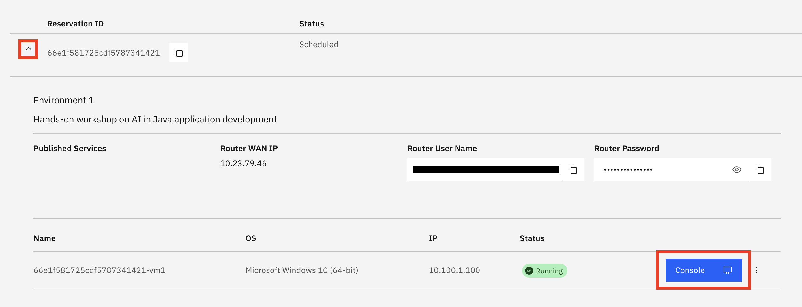
     </div>

3. When prompted, enter the password provided by your instructor to log in to the VM.

## Setting up your workspace in the VM

1. Access the lab instructions

   To follow the lab efficiently, open your preferred browser (Firefox or Chrome) within the VM and use the bookmark named **IBM TechXchange 2024 — Lab 1596 - Hands-on Watsonx Code Assistance for Enterprise Java Applications Lab** in the browser's bookmark bar to access the instructions alongside your IDE window.
   
    <div style="border-left: 4px solid #d3d3d3; padding-left: 10px; margin-bottom: 20px;">
        <p><strong>NOTE</strong>: If you need to transfer text from your local browser into the VM, you can use the <strong>Send Text</strong> feature:</p>
        <ol>
            <li>Copy the desired text from the Lab Guide in your local browser.</li>
            <li>Click on the area within the VM where you want to paste the text.</li>
            <li>Click the <strong>Send Text</strong> button located in the VM command bar.</li>
            <div align="center">
                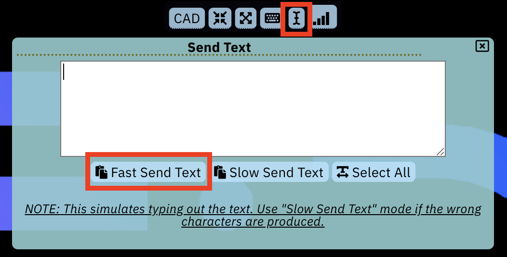
            </div>
            <li>Paste the copied text into the <strong>Send Text</strong> window that appears.</li>
            <li>Click the <strong>Fast Send Text</strong> button to input the text into the VM.</li>
        </ol>
    </div>

2.  Adjust the desktop to fit your screen

    If the desktop does not fit your display, you can resize it by clicking the **Resize** button located in the VM command bar. For the best experience, a minimum resolution of 1920x1080 is recommended.

    <div align="center">
        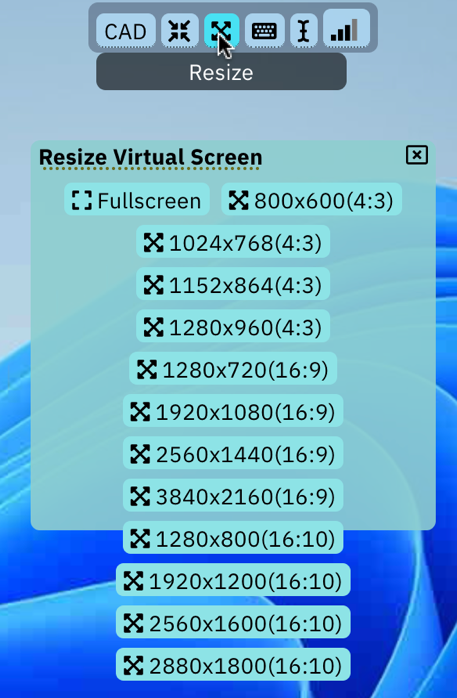
    </div>

## Viewing the application versions
    
Locate and open the folder named **Demo_Lab**, which can be found either on the **Windows Desktop** or in the **Quick Access** menu of File Explorer.

<div align="center">
    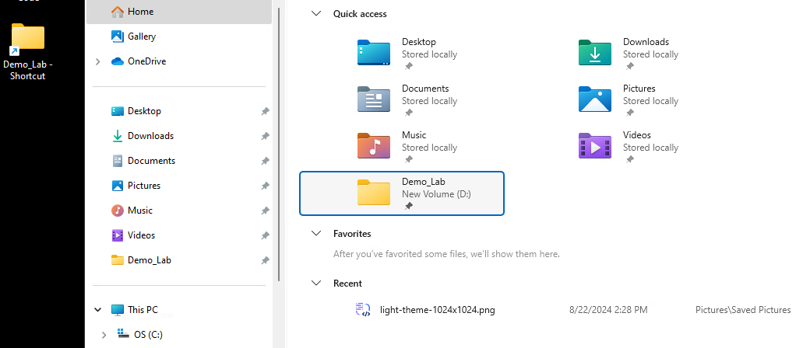
</div>

Inside the **Demo_Lab** folder, you will find the following versions of the lab application:

  - **Completed_Version**: A complete version of the lab demonstrating the application after migrating from WebSphere Application Server to WebSphere Liberty and upgrading to Java 21.

  - **Modernize_to_Liberty**: This basic version of the lab features source code that is incompatible with Liberty and utilizes Java 8, which is not compatible with Java 21. This will serve as the starting point for the lab.

  - **Upgrade_Java**: A work-in-progress version of the lab demonstrating the application after migrating to WebSphere Liberty but still utilizing Java 8.

# Experiencing Watsonx Code Assistant for Enterprise Java Applications

This section will provide guidance on the usage of the features of Watsonx Code Assistant for Enterprise Java Applications.

## WebSphere Application Server modernization to Liberty with Watsonx Code Assistant for Enterprise Java Applications Eclipse IDE plugin

First, let’s start with **Eclipse IDE**. Please Locate and launch the Eclipse IDE from the Windows task bar.

1. After launching Eclipse, the directory **D:
    \Demo_Lab\Modernize_to_Liberty** should be set as default workspace directory.
    If it is not, please manually select the **Modernize_to_Liberty** as the directory. 
    You should see that the **sample-app-mod** have been imported into the IDE. If the project was not imported automatically,
    please import it as a Maven project by going to the
    **File** drop-down menu in the top left corner, then selecting
    **Import -\> Maven -\> Existing Maven Projects**.

2.  To ensure that the project is properly configured with the
    dependencies for the WebSphere Application Server APIs, please run the following commands in
    the Windows terminal (accessible via the Windows taskbar) to install
    the required dependencies into your local Maven project.

    ```bash
    d:

    cd d:\Demo_Lab\Modernize_to_Liberty\sample-app-mod

    mvn install:install-file -Dfile="was_dependency/was_public.jar" -DpomFile="was-dependency/was_public-9.0.0.pom"
    ```

3. The application was originally developed using **traditional WebSphere Application Server** code. With **Watsonx Code Assistant for Enterprise Java Applications**, you can leverage an AI-powered feature to modernize the application for the latest **WebSphere Liberty Server**. To initiate this process, right-click on the project and select **Watsonx Code Assistant for Enterprise Java Applications** → **Modernize to Liberty**. This will open the **Watsonx Code Assistant** extension interface.

    <div align="center">
        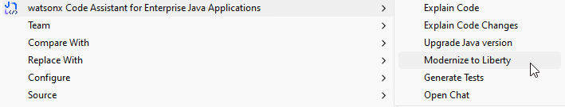
    </div>

    <div style="border-left: 4px solid #d3d3d3; padding-left: 10px; margin-bottom: 20px;">
        <p><strong>NOTE</strong>: Before proceeding to the next step, ensure you see the console message <strong>Retrieving the analysis report completed</strong>.</p>
        <div align="center">
            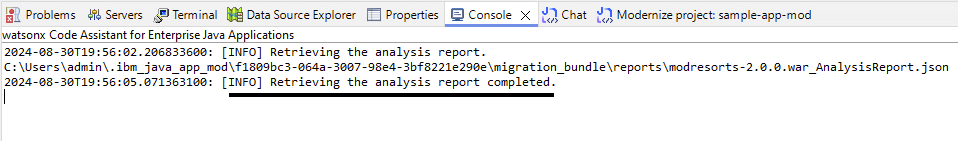
        </div>
    </div>

4.  The tool has two options to migrate the project to Liberty, you can either **upload the migration bundle** which will provide Watsonx Code Assistant for Enterprise Java Applications with analysis and important configuration files to migrate to WebSphere Liberty or use the **binary scanner** if a migration bundle is not available. Note that using the migration bundle is recommended because it has been generated with the configuration information from where the Java application is running, while the binary scanner will not be able to obtain this information. The migration bundle option will be used in this demo. Please locate and open the bundle provided in the project folder (**d:\Demo_Lab\Modernize_to_Liberty\sample-app-mod\migration-bundle\modresorts.ear_migrationBundle.zip**)

    <div align="center">
        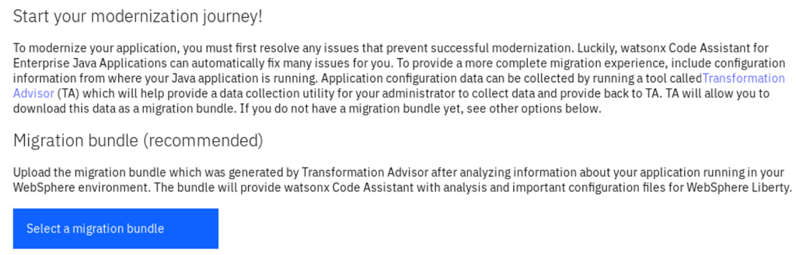
    </div>

    <div align="center">
        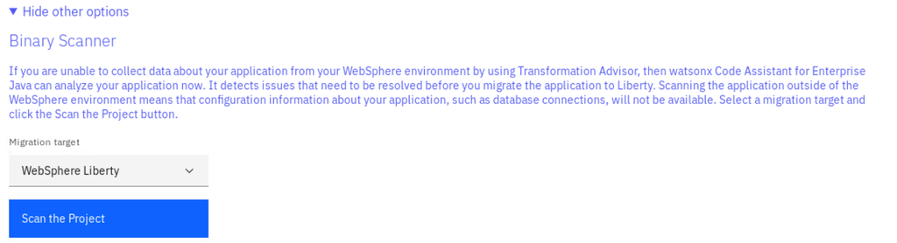
    </div>

5. Watsonx Code Assistant for Enterprise Java Applications will extract configuration files, including `server.xml` and `Containerfile`, from the migration bundle. The `server.xml` file contains the application's configuration, while the `Containerfile` can be used to build a Liberty image of your application. After reviewing these files, add them to the project folder by clicking on **Add Files to Project** to apply the changes.

    <div align="center">
        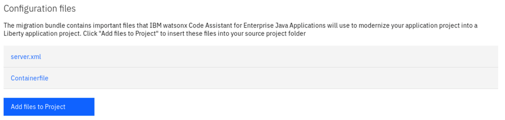
    </div>

6.  Next, a modernization issues list will be presented with the must fix issue detected by Watsonx Code Assistant for Enterprise Java Applications. You can review each issue in detail by clicking on the expand button on the right-hand side of each item. The **Additional information** tab highlights other issues you should be aware of when migrating your application, though these do not require code changes. After the review is complete, click the **Run auto-fixes** button to apply the necessary changes.

    <div align="center">
        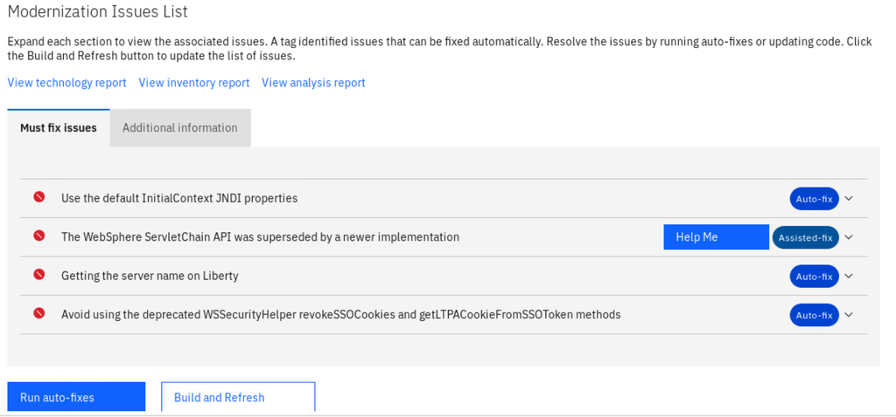
    </div>

7.  After the auto-fix is completed, click on **Build and Refresh** to
    refresh the list.

    <div align="center">
        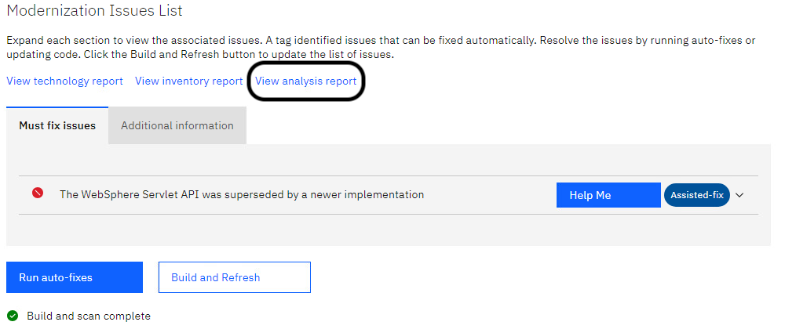
    </div>

8.  An issue has been marked as **Assisted-fix**, indicating that a code change is required, and that Watsonx Code Assistant for Enterprise Java Applications can help us make the required change. Click on the drop-down icon on the issue tab to view the details of the issue. To locate the issue occurrence, click on the `View analysis report` link seen circled. This will open an HTML analysis report in the external browser. Refer to the section of the report entitled **Detailed Results by Rule** to review the results of the related source code reported in **Critical Rules**.

    <div align="center">
        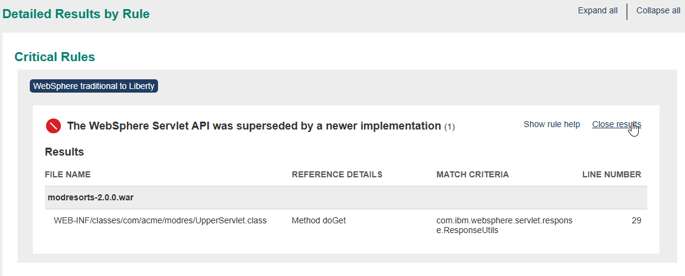
    </div>

9. Open the **src/main/java/com/acme/modres/UpperServlet.java** file and locate the **doGet()** method (lines 19 to 33). Select this code block, then click the **Help me** button in the issue list. The chat window will provide a suggested solution, which includes a new method called **escapeHTML()** and an updated **doGet()** method. 
  
   The updated **doGet()** method uses the new **escapeHTML()** method to replace the existing **ResponseUtils.encodeDataString()** call. Copy both the **escapeHTML()** method and the updated **doGet()** method from the chat window. Then, replace the original **doGet()** method in the source code and add the new **escapeHTML()** method. Save the changes once done.

    <div style="border-left: 4px solid #d3d3d3; padding-left: 10px; margin-bottom: 20px;">
        <p><strong>NOTE</strong>: To implement the new method in your code, simply hover your mouse over the top right corner of each answer, then use the <strong>Page</strong> button to copy and paste.</p>
        <div align="center">
            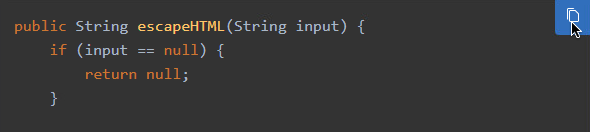
        </div>
    </div>

10. Click on the **Build and Refresh** button to re-verify the changes.
    All the listed issue should be resolved.

    <div align="center">
        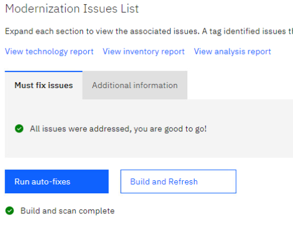
    </div>

11. You can review the recent code changes by enabling the Explain Code Changes feature. This will help you understand the changes made to code by using generative Al to analyze the code before and after the change occurred.

    Right-click on the Project or a file and select Explain Code Changes from the Watsonx Code Assistant for Enterprise Java Applications menu. The code assistant scans the project and presents the code change explanation in a pop-up extension window.

    <div align="center">
        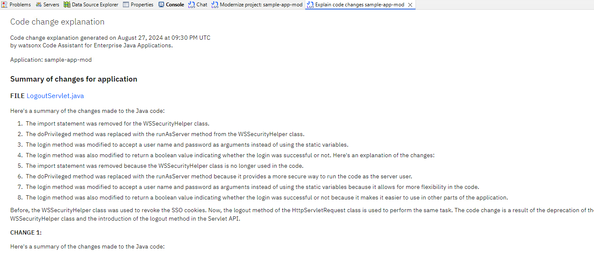
    </div>

    After you review the explanation, you can click **Save Summary** button at the bottom to store the explanation in a local file.

12. Watsonx Code Assistant for Enterprise Java Applications explain code feature provides helps in understanding the
    entire code base. To use this feature in the **current** project,
    right-click on the **sample-app-mod** and select **Explain Code**.
    
    The code assistant then scans the application to identify the system
    dependency graph associated with each class, subsequently providing
    a detailed description in the extension’s chat panel in terms of the
    application overview and explanation for each constituent services.
    This process may take several minutes to complete.
    
    After you review the explanation, you can click **Save Explanation**
    to store the explanation in a local file.

    <div align="center">
        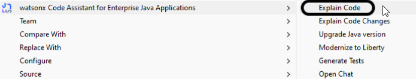
    </div>

13. To confirm the migration is completed, you can add the Liberty maven
    plugin in the **pom.xml** file

    ```bash
    <plugin>
        <groupId>io.openliberty.tools</groupId>
        <artifactId>liberty-maven-plugin</artifactId>
        <version>3.10.3</version>
    </plugin>
    ```

14. Then, try to run the application in Liberty developer mode in the
    same terminal used in step 2. To view the application, please visit
    <http://localhost:9080/resorts>.

    ```bash
    mvn liberty:dev
    ```

15. After you are finished checking out the application, stop the
    Liberty instance by pressing **CTRL+C** in the command-line session
    where you ran Liberty. Alternatively, you can run the
    **liberty:stop** goal from the current directory in another shell
    session:

    ```bash
    mvn liberty:stop
    ```

## Java version upgrade for application with Watsonx Code Assistant for Enterprise Java Applications VSCode IDE plugin

You may close the project in Eclipse IDE and switch over to use **VSCode
IDE**. Please Locate and launch the VSCode IDE from the Windows task bar.

1.  For VSCode IDE, the **Upgrade\_Java** directory should be imported and available to use. If this is not the case, select the **Upgrade\_Java** directory or navigate to D:\Demo_Lab\Upgrade_Java\sample-app-mod

2. Start the application by launching it in Liberty Developer Mode, run
    the following command in the terminal:

    ```bash
    d:
    
    cd d:\Demo_Lab\Upgrade_Java\sample-app-mod
    
    mvn clean package

    mvn liberty:dev
    ```

    To access the application, navigate to <http://localhost:9080/resorts.>
    Then, click on the **Where to?** drop-down menu button. The weather
    information does not seem to load correctly. Fortunately, Watsonx Code Assistant for Enterprise Java Applications can
    assist in identifying the underlying issue and implementing the
    necessary corrections to the code.

    <div align="center">
        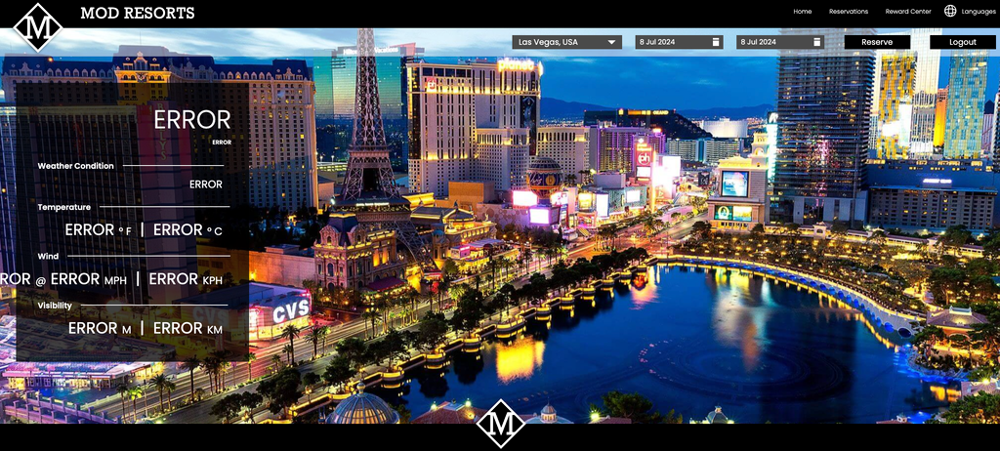
    </div>

    After you are finished checking out the application, stop the Liberty instance by pressing **CTRL+C** or using **mvn liberty:stop** in the command-line session where you ran Liberty.

3. Return to VSCode, navigate to the ModResort Project in the Explorer pane, and right-click on either an empty space within the project folder or on any file in the project to open the context menu. From the menu, select **Watsonx Code Assistant for Enterprise Java Applications** → **Upgrade Java Version**.

    <div align="center">
        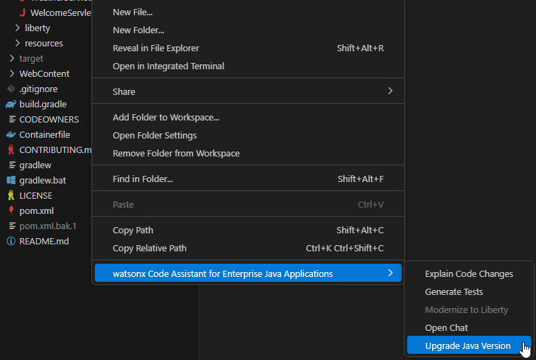
    </div>

4. You will be redirected to a new tab with the option to **Upgrade
    Java Version with Watsonx Code Assistant**. To initiate the
    automated fix and analysis, select the desired Java version from the
    drop-down menu. In this lab, please select **Java 21** and then
    click **Analyze Application.**

    <div align="center">
        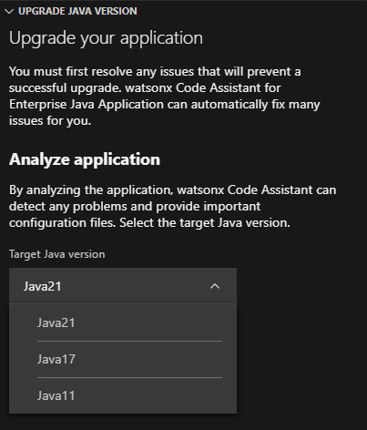
    </div>

5. After Watsonx Code Assistant for Enterprise Java Applications completes its analysis of the application, it provides an overview of the issues detected in the project. You can review each issue in detail. Similar to the steps for WebSphere Application Server migration, the root cause of each issue is also available in the analysis report. The **Additional Information** tab contains issues that describe things to be aware of during migration but don’t necessarily require a code change before migrating to the target. Once your review is complete, click the **Run Auto-fixes** button to apply the necessary changes. After the auto-fixes are applied, click **Rebuild and Refresh** to update the issue list.

    <div align="center">
        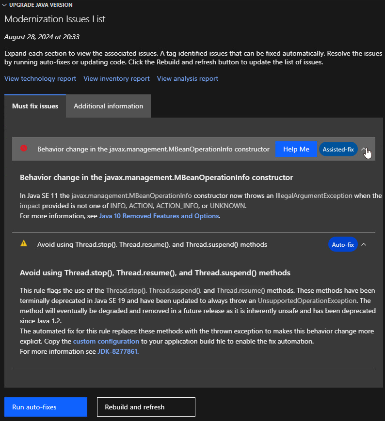
    </div>

6. To resolve the issue marked with the **Assisted-fix** label, click on the issue tab to view the details of the issue. Open the **src/main/java/com/acme/modres/mbean/DMBeanUtils.java** file and locate the **getOps()** method (lines 11 to 34). Select this code block, and then click the **Help me** button in the issue list. The solution details, including an updated **getOps()** method, will appear in the chat window. Replace the existing **getOps()** method in the source code with the returned **getOps()** method provided in the chat window.

7. After the necessary adjustments have been made, you will be prompted
    to click the **Rebuild and Refresh** button to verify the changes.

8. Like the Eclipse plugin, the Watsonx Code Assistant for Enterprise Java Applications plugin for VSCode can also help you understand recent code modifications. Simply right-click on the project or file and select **Explain Code Changes** from the Watsonx Code Assistant for Enterprise Java Applications menu. Watsonx Code Assistant for Enterprise Java Applications will then present a detailed explanation of the changes in a pop-up window.

    <div align="center">
        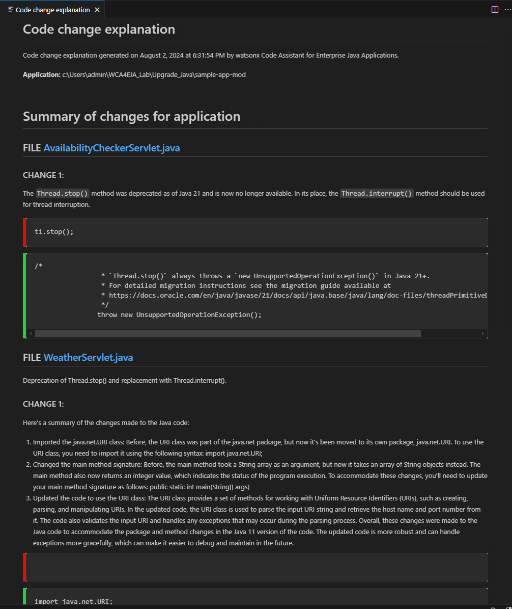
    </div>


9. Restart the application using Liberty development mode using
    following command in the Windows terminal, you should see the
    weather information loading correctly.

    ```bash
    mvn liberty:dev
    ```

    <div align="center">
        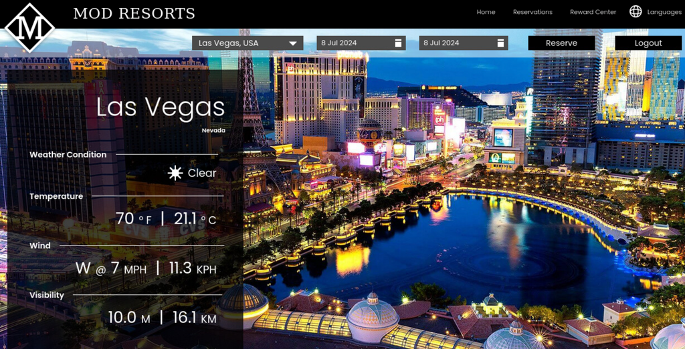
    </div>

    After you are finished checking out the application, stop the Liberty instance by pressing **CTRL+C** or using **mvn liberty:stop** in the command-line session where you ran Liberty.

## Test generation with Watsonx Code Assistant for Enterprise Java Applications VSCode IDE plugin

Continue to use the upgraded application in **VSCode IDE**

1. Run the following command to clean the project and remove any previous build files:

    ```bash
    mvn clean
    ```

2.  Locate and select the file
    **src/main/java/com/acme/modres/db/ModResortsCustomerInformation.java**.
    Right-click the file and select **Watsonx Code Assistant for Enterprise Java Applications** → **Generate Tests**. This process may take a few minutes to complete.

2.  Upon receipt of the **Unit tests generated** message in the
    extension interface, the generated test file can be found in the
    **src/test/java** subfolder of the application.

    <div align="center">
        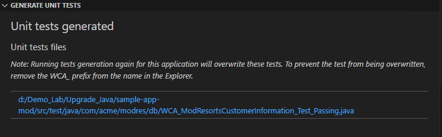
    </div>

3.  Review the generated test file
    **WCA_ModResortsCustomerInformation_Test_Passing.java** and
    rename the **test file** to
    **WCA_ModResortsCustomerInformation_Test.java**. Additionally,
    change the **class** name to
    **WCA_ModResortsCustomerInformation_Test** to align with the
    default Maven test naming conventions.

4.  You can run the tests by executing the following command:

    ```bash
    mvn clean verify
    ```

5. The output will be similar to the following example:
    <div style="border-left: 4px solid #d3d3d3; padding-left: 10px; margin-bottom: 20px; font-family: monospace;">
        <p>-------------------------------------------------------</p>
        <p>T E S T S</p>
        <p>-------------------------------------------------------</p>
        <p>Running com.acme.modres.db.WCA_ModResortsCustomerInformation_Test</p>
        <p>Tests run: 1, Failures: 0, Errors: 0, Skipped: 0, Time elapsed: 3.157 s -- in com.acme.modres.db.WCA_ModResortsCustomerInformation_Test</p>
        <br/>
        <p>Results:</p>
        <br/>
        <p>Tests run: 1, Failures: 0, Errors: 0, Skipped: 0</p>
    </div>
